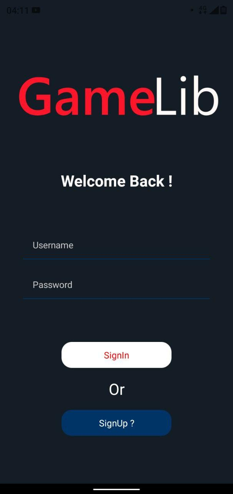
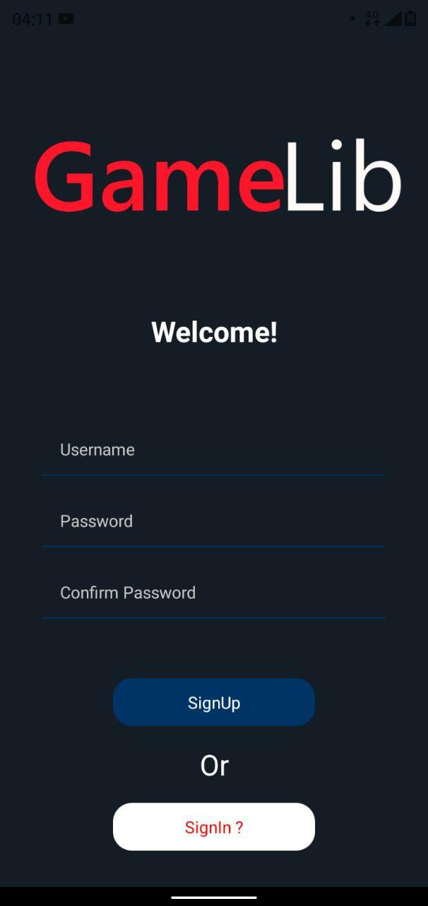
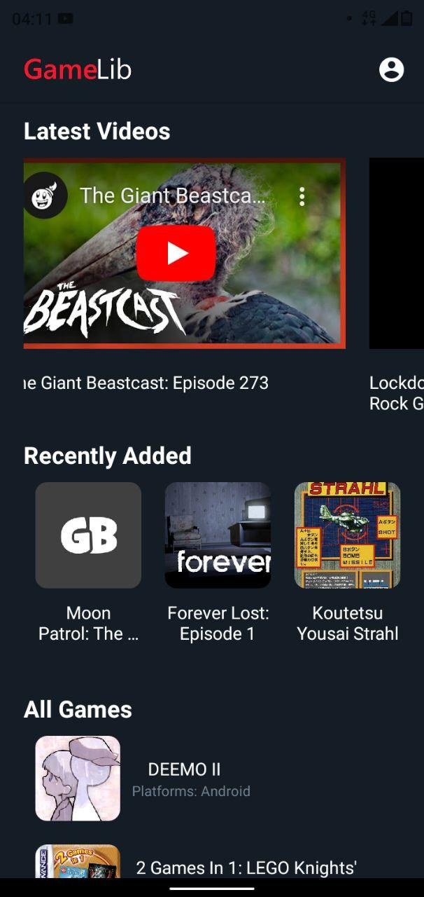
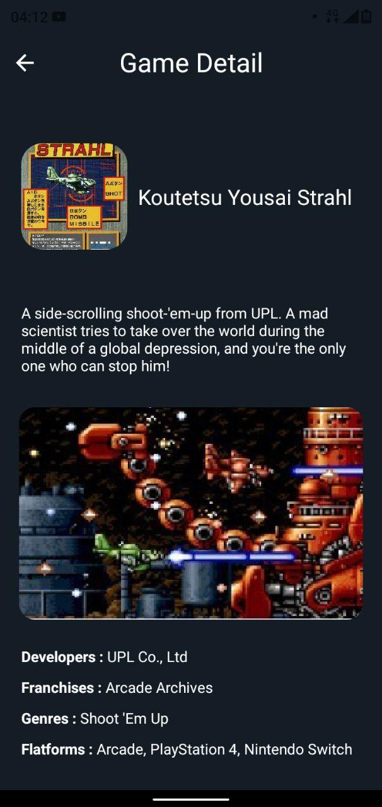

# GameLib

GameLib adalah aplikasi android yang berisi kumpulan data-data Game. yang saya buat dengan tujuan memenuhi Final Project dari bootcamp ReactNative Sanbercode bacth juli yang saya ikuti

## Tool

- ReactNative (Expo)
- Redux (penggunaan tidak efektif, hanya untuk pembelajaran dan memenuhi syarat)
- VScode
- Figma
- NPM
- Paint.net (Logo design)
- Nokia 5.1 Plus - android 10 (untuk menjalankan aplikasi saat pengembangan)

## API

saya menggunakan public api dari https://www.giantbomb.com/api/

## Refrensi

- https://blog.sanbercode.com/ (Materi Bootcamp RN)
- https://stackoverflow.com/
- https://medium.com/
- https://www.youtube.com/
- https://docs.expo.io/
- https://reactnavigation.org/
- https://www.npmjs.com/
- https://reactnative.dev/
- dll

## Tampilan Aplikasi

Video Demo : http://www.youtube.com/watch?v=NuEaTFP1Qbs

## Link file

- Apk : https://exp-shell-app-assets.s3.us-west-1.amazonaws.com/android/%40tiohardadi/GameLib-b7fdc2625598465bbf198b7a648aa107-signed.apk
- Mock up Figma : https://www.figma.com/file/31qmAEYWfGBx7hRSioC8t6/final-project-sanbercode?node-id=0%3A1

## Akun Tester

-username : tester
-password : 12345678
